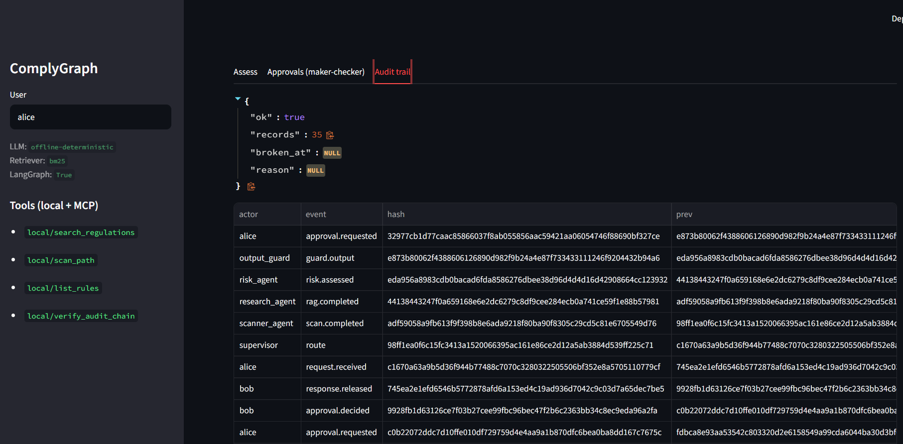
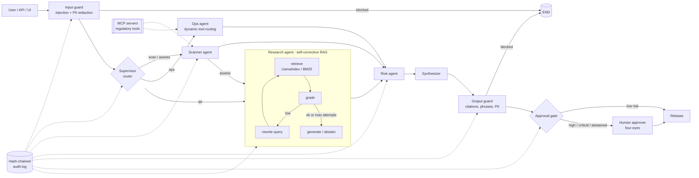

# ComplyGraph

**Multi-agent regulatory compliance copilot for financial services and consulting.**
LangGraph orchestration · MCP tool layer · self-corrective agentic RAG (LlamaIndex) · deterministic guardrails ·
maker-checker human approval · tamper-evident audit trail · declarative regulatory scanner (GDPR, EU AI Act, DORA, SR 11-7, NIST AI RMF).

It answers regulatory questions with citations, scans code/config for control gaps, rates risk, and **holds
high-risk output for a second human** before release - with every step recorded in a hash-chained audit log.


## Why this shape 

| Buyer concern | How it is addressed |
|---|---|
| Model risk (SR 11-7 / OCC 2011-12, internal MRM) | LLM never sits in the enforcement path; guardrails are deterministic and unit-tested; abstention instead of guessing |
| Third-party / concentration risk (DORA Art. 28-30) | Provider abstraction (`llm.py`), offline mode, MCP boundary, documented exit path |
| Human oversight (EU AI Act Art. 14, GDPR Art. 22) | Approval gate with **four-eyes** (requester can never approve own output) |
| Record-keeping (EU AI Act Art. 12) | `audit.py`: append-only JSONL, SHA-256 chain, optional HMAC signing, `verify` endpoint/tool |
| Data protection (GDPR Art. 5, 25, 32) | PII redaction before model/log; audit stores redacted, truncated text + hash only |
| CI/CD integration, evidence for auditors | SARIF 2.1.0 export (GitHub/Azure DevOps/Sonar-style viewers), `--fail-on` exit codes |
| Reproducibility | Rules, policies, and corpus are version-controlled YAML/Markdown; temperature 0 |

## Architecture



## Quick start (no API keys, no heavy deps - runs fully offline)

```bash
pip install pyyaml pydantic            # core only
PYTHONPATH=src python -m complygraph.cli demo
PYTHONPATH=src python -m complygraph.cli scan examples/credit_scoring_service --format sarif > out.sarif
PYTHONPATH=src python -m complygraph.cli approve <id> --as bob     # second person releases held output
```

### Full stack

```bash
pip install -e ".[all,dev]"
cp .env.example .env                    # add ANTHROPIC_API_KEY / OPENAI_API_KEY; optional COMPLYGRAPH_EMBED_MODEL
make test
make api      # http://localhost:8000/docs   (X-API-Key: dev-analyst | dev-approver | dev-auditor)
make ui       # Streamlit workbench
COMPLYGRAPH_USE_MCP=1 make api          # tools discovered via MCP (config/mcp_servers.json)
```

The same MCP server works from Claude Desktop or any MCP client: `python -m complygraph.mcp_server`.

## Modes

| Component | Full stack | Fallback (auto) |
|---|---|---|
| Orchestration | LangGraph `StateGraph` | in-process runner with identical API (`graph_runtime.py`) |
| Retrieval | LlamaIndex vector index (`COMPLYGRAPH_EMBED_MODEL`) | built-in BM25 |
| LLM | Anthropic / OpenAI-compatible (Azure gateway via `OPENAI_BASE_URL`) | deterministic heuristics |
| Tools | MCP via `langchain-mcp-adapters` | in-process tools (same functions) |

## API

| Endpoint | Role | Purpose |
|---|---|---|
| `POST /v1/assess` | analyst | question or gap assessment (`scan_path` optional) |
| `POST /v1/scan/sarif` | analyst | SARIF export |
| `GET/POST /v1/approvals[/{id}]` | approver | review queue, approve/reject |
| `GET /v1/audit/verify`, `GET /v1/audit` | auditor | integrity proof, event log |

## Extending

* **New regulation**: drop a `## `-sectioned Markdown file in `data/regulations/` (retrieval picks it up), add glossary terms in `rag/corrective.py`, add rules in `config/rules.yaml`.
* **New rule**: three types - `pattern`, `cooccur_missing`, `project_missing` (see header of `rules.yaml`). Gate with `applies_if` to avoid false positives.
* **New MCP server**: add to `config/mcp_servers.json`; the `Toolbox.route()` ranks its tools automatically.
* **Policy**: `config/policies.yaml` (injection patterns, forbidden phrases, approval tiers, four-eyes).

## Production hardening checklist

1. Set `COMPLYGRAPH_AUDIT_HMAC_KEY` from a KMS; replicate `audit.jsonl` to WORM storage (S3 Object Lock).
2. Replace API-key auth with SSO/OIDC at the gateway; map groups to roles; swap the JSON approval store for Postgres.
3. Pin an EU region / contractual transfer mechanism for the LLM provider; register it in your DORA register of information.
4. Have Legal/Compliance own `data/regulations/` - the shipped files are **plain-language summaries, not legal text**; they must be replaced or validated against official sources, and regulatory dates change (e.g. EU AI Act high-risk timelines under the Digital Omnibus).
5. Run the system through your own model-validation process (SR 11-7 / MRM) before relying on it.


> Decision-support tooling. Not legal advice.
